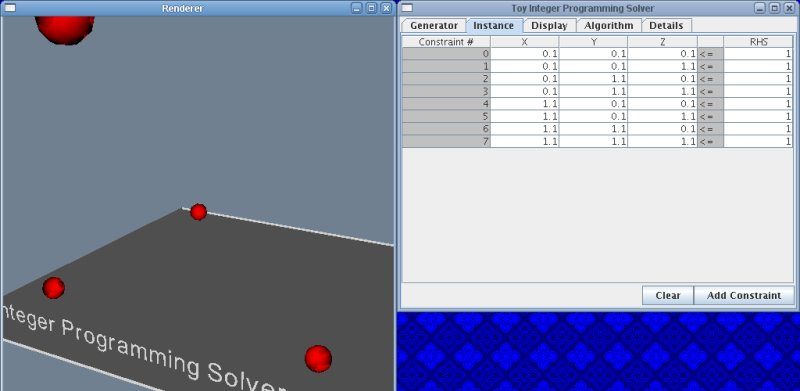

## Jakub Marecek

My personal homepage proper is at <a href="http://cs.nott.ac.uk/~jxm">http://cs.nott.ac.uk/~jxm</a>. This is just my slides from SAGE Days 9 (<a href="JakubMarecek/slides.pdf">slides.pdf</a>) and related stuff: 

**Graphical Demo of Integer Programming: ** 

* My goal was to present the workings of an integer programming solver in an interactive Java Web Start. This proved, however, rather difficult. First, it's difficult to get Java (and the more Java Web Start) applications to run with VTK. Second, VTK crashes the JVM when I render anything but the most trivial polyhedra.   
* I am afraid that the lesson is VTK is no good in Java, if anywhere. If you wanted to play with this, feel free to: <a href="JakubMarecek/toy-ip-0.1.1-bin.zip">toy-ip-0.1.1-bin.zip</a> <a href="JakubMarecek/toy-ip-0.1.1-src.zip">toy-ip-0.1.1-src.zip</a> 
* Notice, however, that you need VTK with Java Wrappers installed in order (not) to run this. 
**Installing VTK with Java Wrappers: ** 

* Download VTK sources and ccmake. 
* Even the latest stable version of VTK (5.0.4) makes some weird assumptions about namespaces. In order to make it compile with GCC 4.3, replace #include <string> with  #include <string.h> in all cxx files -- and similarly for other C library headers. 
* Add vtk.jar to your classpath. Notice the jar file can end up in a fresh /VTK-build/, even though you have specified other build output directory. 
* Add the directory where libvtkRenderingJava.so resides to your path. Export to PATH seems to work just as well as -Djava.library.path=~/VTK-build/bin/ at java's command line. 
* Add libmawt.so to you LD_LIBRARY_PATH in your environment. Export seems to work, although -DLD_LIBRARY_PATH at java's command line does not. 
**SVG and PDF Output for <a href="/JyScript">JyScript</a>. ** 

* This should be a quick hack using Apache Batik (<a href="http://xmlgraphics.apache.org/batik/">http://xmlgraphics.apache.org/batik/</a>). Replace the standard Graphics2D with the Graphics2D from Batik to get SVG export. 

```txt
import org.w3c.dom.Element;
import org.w3c.dom.DOMImplementation;
import org.w3c.dom.svg.SVGDocument;
import org.apache.batik.swing.JSVGCanvas;
import org.apache.batik.svggen.SVGGraphics2D;
import org.apache.batik.dom.svg.SVGDOMImplementation;
import org.apache.batik.transcoder.TranscoderInput;
import org.apache.batik.transcoder.TranscoderOutput;
import org.apache.fop.svg.PDFTranscoder;
public class Demo extends Applet {
 /* ... */
 public static void export() {
   DOMImplementation impl = SVGDOMImplementation.getDOMImplementation();
   String svgNS = SVGDOMImplementation.SVG_NAMESPACE_URI;
   SVGDocument doc = (SVGDocument)impl.createDocument(svgNS, "svg", null);
   SVGGraphics2D g = new SVGGraphics2D(doc);
   /* Here use can use g as if it was the usual canvas */
   /* Here we make it visible */
   Element root = doc.getDocumentElement();
   g.getRoot(root);
   JSVGCanvas canvas = new JSVGCanvas();
   JFrame f = new JFrame();
   f.getContentPane().add(canvas);
   canvas.setSVGDocument(doc);
   f.pack();
   f.setVisible(true);
   /* Here we produce the PDF */
   try {
     PDFTranscoder pdfTranscoder = new PDFTranscoder();
     TranscoderInput tIn = new TranscoderInput(doc);
     FileOutputStream fileOut = new FileOutputStream("test.pdf");
     TranscoderOutput tOut = new TranscoderOutput(fileOut); pdfTranscoder.transcode(tIn, tOut); fileOut.flush(); fileOut.close();
    } catch(Exception e) {e.printStackTrace();}
 }
```
**TeX and PS and PDF Output for SAGE plot3ds ** 

* This could perhaps be done using Sketch (<a href="http://www.frontiernet.net/~eugene.ressler/">http://www.frontiernet.net/~eugene.ressler/</a>). It implements the painter's algorithm (z-buffering) with polygon splitting, and hence it should be just the output of triangles in the right format it takes. Nils (<a href="http://www.cecm.sfu.ca/~nbruin">http://www.cecm.sfu.ca/~nbruin</a>) now got that to work, sortof: 

```txt
P.triangulate()
vl=P.vertex_list()
fl=P.face_list()
import os
F=open("a.sk","w")
F.write("def mymy {\n")
for a in fl:
  F.write('  polygon')
  F.write(''.join(['('+str(p[0])+','+str(p[1])+','+str(p[2])+')' for p in a]))
  F.write('\n')
  a.reverse()
  F.write('  polygon')
  F.write(''.join(['('+str(p[0])+','+str(p[1])+','+str(p[2])+')' for p in a]))
  F.write('\n')
  F.write("}\n")
  F.write("put { view((2,2.5,2)) } {mymy}\n")
  F.close()
os.system("/localhome/sage/bin/sketch -V1.0 -T a.sk -o a.tex")
os.system("latex a.tex >/dev/null")
os.system("dvips a.dvi -o >/dev/null")
os.system("convert a.ps a.png")
```
See this for yourself at <a href="https://hydrogen.irmacs.sfu.ca:8000/home/pub/8/">https://hydrogen.irmacs.sfu.ca:8000/home/pub/8/</a> 

<a href="/CategoryHomepage">CategoryHomepage</a> 
